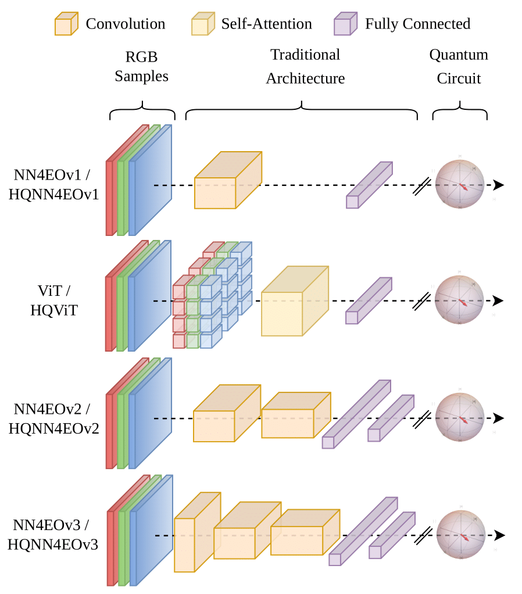

# Evaluating Key Design Aspects in Simulated Hybrid Quantum Neural Networks for Earth Observation

This repository contains code and resources to explore key design aspects of Hybrid Quantum Neural Networks (HQNN) applied to Earth Observation tasks. The work examines performance factors, comparing various model architectures using simulated quantum environments.

## Getting Started

To run the code, you can use the following Docker images:

- **For Qiskit models**: `lorenzopapa5/cuda12.1.0-python3.8-pytorch2.4.0-esa`
- **For PennyLane models**: `lorenzopapa5/cuda12.1.0-python3.8-pytorch2.4.0-esa-hqm`

These images include all necessary dependencies, including CUDA, Python 3.8, PyTorch 2.4.0, and respective quantum libraries for the models used in this study.

### Running the Code

- **To run Qiskit models**, execute: `main_binary_qkit.py`
- **To run PennyLane models**, execute: `main_binary_pl.py`

Ensure you are using the correct Docker image depending on the model you are running.

## Model Architectures



## Results

### Quantum Models Comparison over Qiskit and PennyLane Libraries

| Models     | Qiskit $\overline{Acc}$ | Qiskit \textit{k*} | PennyLane $\overline{Acc}$ | PennyLane \textit{k*} |
|------------|--------------------------|---------------------|----------------------------|------------------------|
| HQNN4EOv1  | **91.93**                | 16.31              | 91.80                      | **15.53**              |
| HQNN4EOv2  | 92.35                    | 16.36              | **92.51**                  | **16.11**              |
| HQNN4EOv3  | **93.45**                | 15.89              | 93.15                      | **15.46**              |
| HQViT      | **87.95**                | 16.25              | 87.77                      | **16.20**              |

### Model's Comparison over $k$ Initialization Values

| Models      | Traditional $\overline{Acc}$ | Traditional $\overline{\sigma}^2$ | Quantum $\overline{Acc}$ | Quantum $\overline{\sigma}^2$ |
|-------------|------------------------------|------------------------------------|---------------------------|--------------------------------|
| NN4EOv1 / HQNN4EOv1 | 90.87              | 3.85                               | **90.90**                | **3.25**                       |
| NN4EOv2 / HQNN4EOv2 | **92.66**           | **4.25**                           | 92.56                    | 4.44                            |
| NN4EOv3 / HQNN4EOv3 | 93.00               | 2.72                               | **93.47**                | **2.45**                       |
| ViT / HQViT         | 88.37               | **3.47**                           | **88.78**                | 7.77                            |

## Paper

For more details on the design aspects and methodologies used in this study, please refer to our [arXiv paper](https://arxiv.org/abs/2410.08677).

## Citation

If you use this code or reference our work, please cite our paper as follows:

```bibtex
@article{papa2024impact,
  title={On the impact of key design aspects in simulated Hybrid Quantum Neural Networks for Earth Observation},
  author={Papa, Lorenzo and Sebastianelli, Alessandro and Meoni, Gabriele and Amerini, Irene},
  journal={arXiv preprint arXiv:2410.08677},
  year={2024}
}
